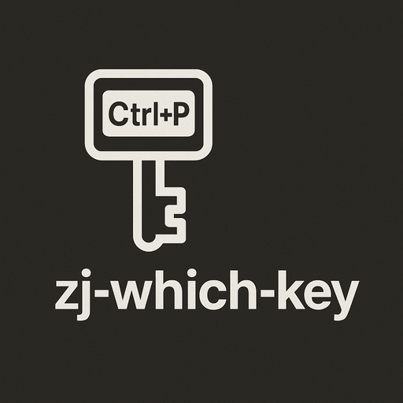
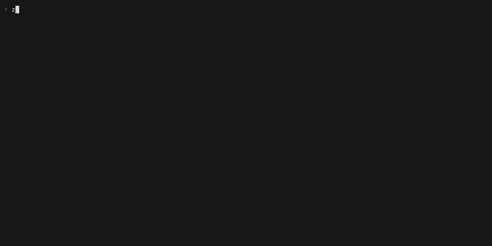

<p align="center">
  
</p>

A Zellij plugin that shows you available keybindings for the current mode in a floating overlay. Sort of a standalone version of what comes with the built-in compact-bar. I use this with [zjstatus](https://github.com/dj95/zjstatus) but could be used without a bar at all for example.

Press Ctrl+p to enter Pane mode, and zj-which-key automatically shows you what keys are available. No more forgetting how to split panes or switch tabs.



## Features

- **Mode-aware**: Shows only relevant keybindings for your current mode (Pane, Tab, Resize, etc.)
- **Auto-show**: Appears when you enter a mode, disappears when you leave
- **Full-width display**: Multi-column layout shows many keybindings at once
- **Bottom-left positioning**: Out of the way but easy to see
- **Basic styling**: Perhaps not the prettiest, but it should work with any Zellij theme

## Installation

Requires [Zellij](https://zellij.dev) 0.43+

### With Nix Flakes

```bash
# Build and get the WASM plugin
nix build github:yourusername/zj-which-key

# Plugin will be at:
# result/share/zellij/plugins/zj_which_key.wasm
```

Or add to your flake inputs:

```nix
{
  inputs.zj-which-key.url = "github:yourusername/zj-which-key";

  # Then reference:
  # inputs.zj-which-key.packages.${system}.default
}
```

### Build from Source

```bash
# Clone the repository
git clone https://github.com/yourusername/zj-which-key
cd zj-which-key

# Build the WASM plugin
cargo build --release

# The plugin will be at: target/wasm32-wasip1/release/zj_which_key.wasm
```

### Setup with devenv

This project uses devenv for development:

```bash
# devenv automatically provides Rust with wasm32-wasip1 target
cargo build --release
```

## Usage

### Quick Start

Add to your Zellij configuration (`~/.config/zellij/config.kdl`):

```kdl
load_plugins {
    "file:/path/to/zj_which_key.wasm" {
        auto_show_on_mode_change "true"
        hide_in_base_mode "true"
        max_lines "20"
    }
}
```

Then start Zellij normally:

```bash
zellij
```

### Configuration Options

- `auto_show_on_mode_change` (default: `"true"`): Automatically show overlay when entering non-normal modes
- `hide_in_base_mode` (default: `"true"`): Automatically hide when returning to Normal mode
- `max_lines` (default: `"20"`): Maximum number of keybindings to display

### Keybindings

- **Ctrl+g**: Toggle the overlay on/off manually
- **Ctrl+p, Ctrl+t, etc.**: Entering any mode auto-shows the overlay (if configured)
- **Esc**: Returning to Normal mode auto-hides the overlay (if configured)

## How It Works

zj-which-key uses a dual-instance architecture:

1. **Main instance**: Runs in the background, listens for mode changes
2. **Overlay instance**: Spawned as a floating pane when needed, positioned at bottom-left

When you enter a mode like Pane (Ctrl+p), the main instance spawns a floating overlay showing:
- Mode-specific keybindings (pane management, focus, resize)
- Shared keybindings (return to Normal, quit)
- Organized into categories for easy scanning

The overlay automatically closes itself when you return to Normal mode or when you press Ctrl+g.

## Development

### Prerequisites

- Rust with `wasm32-wasip1` target
- Or use [devenv](https://devenv.sh) (configured in this repo)

### Build Commands

```bash
# Development build
cargo build

# Release build (optimized)
cargo build --release

# Watch mode (requires cargo-watch)
cargo watch -x 'build --release'

# Output at:
# target/wasm32-wasip1/release/zj_which_key.wasm
```

### Testing

Test with the example configuration:

```bash
zellij --config examples/config.kdl --layout examples/layout.kdl
```

Check debug logs:

```bash
tail -f /tmp/zellij-*/zellij-log/zellij.log | grep "zj-which-key"
```

### Project Structure

```
zj-which-key/
├── src/bin/zj_which_key.rs  # Main plugin code
├── examples/
│   ├── config.kdl           # Example Zellij config
│   └── layout.kdl           # Example layout
├── .cargo/config.toml       # Sets default WASM target
├── devenv.nix               # devenv configuration
└── Cargo.toml
```

## Architecture

The plugin operates in two modes:

**Main Instance (Background)**:
- Loaded via `load_plugins` in config.kdl
- Monitors mode changes and key presses
- Spawns overlay instances with specific coordinates
- Tracks terminal dimensions via TabUpdate events

**Overlay Instance (Floating)**:
- Created programmatically via `pipe_message_to_plugin()`
- Positioned at bottom-left with `FloatingPaneCoordinates`
- Renders keybindings in multi-column layout
- Closes itself autonomously when returning to base mode

This architecture allows proper positioning control, unlike using `show_self()`/`hide_self()` on layout-defined panes.

## Contributing

Contributions welcome! Areas for improvement:

- Support for configurable toggle key (currently hardcoded to Ctrl+g)
- Dynamic column width based on longest keybinding
- Theme color integration (currently uses fixed colors)
- Configurable positioning
- Better action descriptions for complex keybindings

## License

MIT

## Acknowledgments

- Inspired by [which-key](https://github.com/justbur/emacs-which-key) for Emacs
- Architecture based on [compact-bar](https://github.com/zellij-org/zellij/tree/main/default-plugins/compact-bar)'s tooltip system
- Built for [Zellij](https://zellij.dev)
