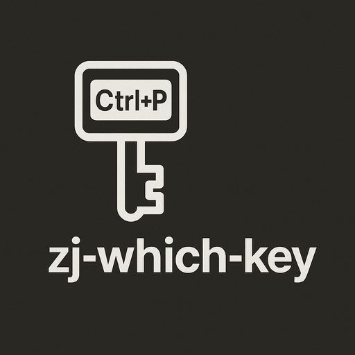
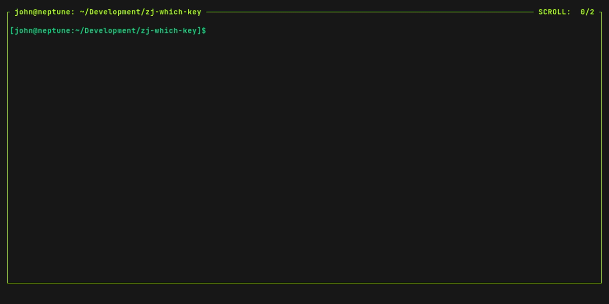

<p align="center">
  
</p>

A Zellij plugin that shows the keybindings for your current mode in a small
floating popup, a short moment after you enter the mode - like emacs which-key.
Press a mode key (say `Ctrl+p` for Pane mode), pause, and a tucked-away corner
popup reminds you how to split panes, resize, switch tabs, and so on. It pairs
well with a custom status bar like [zjstatus](https://github.com/dj95/zjstatus),
but works on its own too.

There's also a searchable browser (one keybind) that lists every binding across
every mode, so you can fuzzy-find "how do I detach?" without leaving Zellij.



## ✨ Features

- **Delayed, which-key style** - the popup only appears if you pause in a mode,
  so it never nags when you already know the key.
- **Mode-specific** - shows the keys that mode adds, grouped by action
  (`h j k l ← ↓ ↑ →  Move focus`). Global keys live in the browser, not the popup.
- **Floating, never in the way** - a content-sized box in a screen corner that
  doesn't reflow your terminal, and vanishes when you return to the base mode.
- **Searchable browser** - fuzzy-find across all modes, with a Global section for
  keys that work everywhere.
- **Theme-agnostic** - plain ANSI colors that sit fine on any Zellij theme.

## Requirements

[Zellij](https://zellij.dev) 0.43+. You also need to **pre-approve the plugin's
permissions** before first run - its UI can't receive the keystroke to grant them
interactively. See [Permissions](#permissions).

## Install

### With Nix flakes

```bash
nix build github:johnae/zj-which-key
# plugin ends up at: result/share/zellij/plugins/zj_which_key.wasm
```

Or as a flake input:

```nix
{
  inputs.zj-which-key.url = "github:johnae/zj-which-key";
  # reference: inputs.zj-which-key.packages.${system}.default
}
```

### From source

You need the `wasm32-wasip1` Rust target (the included [devenv](https://devenv.sh)
provides it):

```bash
git clone https://github.com/johnae/zj-which-key
cd zj-which-key
cargo build --release
# plugin at: target/wasm32-wasip1/release/zj_which_key.wasm
```

## Configure

The plugin is loaded once in the background (the "controller"). It watches mode
changes and spawns the popup; a keybind launches the browser. Add this to your
`~/.config/zellij/config.kdl`, pointing at the built `.wasm`:

```kdl
load_plugins {
    "file:/path/to/zj_which_key.wasm" {
        auto_show "true"        // show the popup on entering a non-base mode
        delay_secs "0.4"        // idle delay before it appears
        position "bottom-right" // or "bottom-left"
        max_height_pct "40"     // cap height at this % of the screen
    }
}

keybinds {
    shared_except "locked" {
        bind "Ctrl y" {
            LaunchOrFocusPlugin "file:/path/to/zj_which_key.wasm" {
                floating true
                role "browser" // must be a direct child, not under `configuration`
            }
        }
    }
}
```

In the browser: type to fuzzy-filter, `↑`/`↓` (or `Ctrl+n`/`Ctrl+p`) to scroll,
`Esc` to close. It's a read-only reference - look up the key, close, press it.

A ready-to-run example lives in [`examples/config.kdl`](examples/config.kdl):

```bash
cargo build --release
zellij --config examples/config.kdl
```

## Permissions

You must **pre-approve this plugin's permissions before first run.** Zellij
normally grants permissions by asking you to press `y` in the plugin's pane - but
neither of this plugin's UI panes can receive that keystroke. The popup is
non-selectable (by design, so it never steals focus from your mode), and a
background-loaded plugin can't show an approvable prompt at all
([zellij #4982](https://github.com/zellij-org/zellij/issues/4982)). It's a known
Zellij limitation, not something the plugin can work around - so the grant has to
happen ahead of time, in Zellij's permissions cache.

Add an entry to `permissions.kdl` (Linux: `~/.cache/zellij/permissions.kdl`,
honoring `$XDG_CACHE_HOME`; macOS:
`~/Library/Caches/org.Zellij-Contributors.Zellij/permissions.kdl`). The key is
the plugin's absolute path with no `file:` prefix:

```kdl
"/path/to/zj_which_key.wasm" {
    ReadApplicationState
    ChangeApplicationState
    MessageAndLaunchOtherPlugins
}
```

One entry covers all three roles (permissions are keyed by path, not config). If
you manage Zellij with Nix/home-manager, generate this file declaratively keyed
by the plugin's store path and it just works across version bumps.

## How it works

One wasm binary runs in three roles, selected by the `role` config key:

- **Controller** (background, via `load_plugins`) - has no pane. Watches mode
  changes and, after the idle delay, spawns the popup. One per client, so
  per-client mode state stays isolated.
- **Popup** (spawned, floating, non-selectable) - renders the current mode's
  keys in a corner and closes itself on the base mode.
- **Browser** (launched by keybind, focused) - the searchable all-modes view.

## Contributing

Issues and PRs welcome. Some known limitations and ideas:

- A plugin can't execute another binding's action, so the browser is lookup-only.
- The popup's corner position is configurable; full layout control is not (yet).
- Better human labels for unusual/custom actions.

## License

MIT

## Acknowledgments

- Inspired by [which-key](https://github.com/justbur/emacs-which-key) for Emacs.
- Built for [Zellij](https://zellij.dev).
